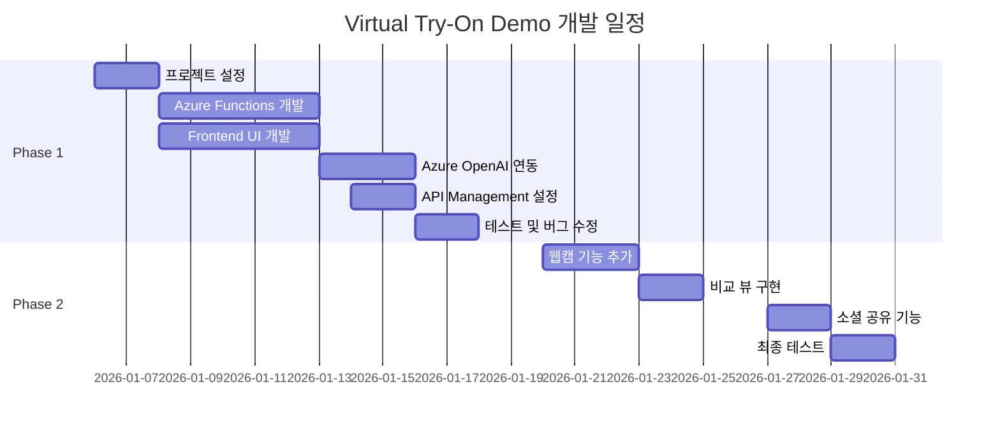

# 프로젝트 계획서: Virtual Clothing Try-On 데모

## 📋 프로젝트 개요

| 항목 | 내용 |
|------|------|
| **프로젝트명** | Virtual Clothing Try-On Demo |
| **목적** | 리테일 업종 대상 AI 기반 가상 의류 피팅 솔루션 데모 |
| **기술 기반** | Azure OpenAI gpt-image-1.5 |
| **타겟 사용자** | 리테일 기업, 이커머스 플랫폼, 패션 브랜드 |

---

## 🎯 비즈니스 목표

### 문제 정의
- 온라인 쇼핑 시 의류 반품률 약 30-40% (사이즈/핏 불일치)
- 오프라인 매장 방문 없이 의류 착용감 확인 어려움
- 고객 구매 결정 지연으로 인한 전환율 저하

### 솔루션 가치
1. **반품률 감소**: 구매 전 가상 피팅으로 사이즈/스타일 확인
2. **구매 전환율 향상**: 즉각적인 시각적 피드백으로 구매 결정 촉진
3. **고객 경험 개선**: 재미있고 인터랙티브한 쇼핑 경험 제공
4. **운영 비용 절감**: 반품 처리 및 재고 관리 비용 감소

---

## 🏗️ 기술 아키텍처

### 시스템 구성도

```
┌─────────────────────────────────────────────────────────────────────┐
│                         Client (Browser)                            │
│                     Next.js 14 + Tailwind CSS                       │
└─────────────────────────────┬───────────────────────────────────────┘
                              │ HTTPS
                              ▼
┌─────────────────────────────────────────────────────────────────────┐
│                    Azure API Management                             │
│  ┌───────────────────────────────────────────────────────────────┐  │
│  │  • Subscription Key Authentication                            │  │
│  │  • Rate Limiting & Throttling                                 │  │
│  │  • CORS Configuration                                         │  │
│  │  • Request/Response Caching                                   │  │
│  │  • API Versioning (/api/v1/*)                                │  │
│  └───────────────────────────────────────────────────────────────┘  │
└─────────────────────────────┬───────────────────────────────────────┘
                              │
                              ▼
┌─────────────────────────────────────────────────────────────────────┐
│                      Azure Functions                                │
│  ┌─────────────────┐ ┌─────────────────┐ ┌─────────────────────┐   │
│  │  Health Check   │ │ Clothing Catalog│ │   Try-On Service    │   │
│  │  GET /health    │ │ GET /clothing/* │ │ POST /try-on        │   │
│  └─────────────────┘ └─────────────────┘ └──────────┬──────────┘   │
│                                                      │              │
│                          Python 3.11 + Blueprints    │              │
└──────────────────────────────────────────────────────┼──────────────┘
                                                       │
                              ┌─────────────────────────┤
                              ▼                         ▼
                    ┌─────────────────┐      ┌─────────────────┐
                    │  Azure OpenAI   │      │  Azure Blob     │
                    │  gpt-image-1.5  │      │  Storage        │
                    └─────────────────┘      └─────────────────┘

┌─────────────────────────────────────────────────────────────────────┐
│                    Azure Static Web Apps                            │
│                         (Frontend Hosting)                          │
└─────────────────────────────────────────────────────────────────────┘
```

### 기술 스택

| 계층 | 기술 | 선택 이유 |
|------|------|----------|
| **Frontend** | Next.js 14, TypeScript, Tailwind CSS | SSR 지원, 타입 안정성, 빠른 스타일링 |
| **API Gateway** | Azure API Management (Consumption) | 인증, Rate Limiting, 캐싱, CORS 중앙 관리 |
| **Backend** | Azure Functions (Python 3.11) | 서버리스, 자동 스케일링, 비용 효율성 |
| **AI Engine** | Azure OpenAI gpt-image-1.5 | 고품질 이미지 편집, 신원 보존, 사실적 렌더링 |
| **Storage** | Azure Blob Storage | 확장성, Azure 생태계 통합 |
| **Hosting** | Azure Static Web Apps | 글로벌 배포, GitHub 통합, 자동 SSL |
| **CI/CD** | GitHub Actions | 자동화된 배포 파이프라인 |

### Azure Functions 구조

```
backend/
├── function_app.py          # 메인 엔트리포인트 (Blueprint 등록)
├── host.json                # 호스트 설정 (라우트 접두사)
├── local.settings.json      # 로컬 개발 환경 변수
├── requirements.txt         # Python 의존성
│
├── functions/               # Azure Functions (HTTP 트리거)
│   ├── health.py           # GET /api/v1/health
│   ├── clothing.py         # GET /api/v1/clothing/*
│   └── tryon.py            # POST /api/v1/try-on
│
└── shared/                  # 공유 모듈
    ├── models.py           # Pydantic 데이터 모델
    ├── catalog.py          # 의류 카탈로그 데이터
    ├── azure_openai.py     # Azure OpenAI 클라이언트
    └── image_processor.py  # 이미지 처리 유틸리티
```

---

## 💡 주요 기능

### Phase 1: MVP (2주)

| 기능 | 설명 | 우선순위 |
|------|------|----------|
| 사진 업로드 | 드래그앤드롭, 파일 선택 방식 지원 | P0 |
| 의류 카탈로그 | 카테고리별 의류 브라우징 (상의, 하의, 원피스, 아우터) | P0 |
| 가상 피팅 | Azure OpenAI를 활용한 의류 합성 | P0 |
| 결과 다운로드 | 피팅 결과 이미지 저장 | P0 |
| 반응형 UI | 모바일/태블릿/데스크톱 지원 | P1 |

### Phase 2: Enhanced (2주)

| 기능 | 설명 | 우선순위 |
|------|------|----------|
| 웹캠 촬영 | 실시간 카메라 캡처 | P1 |
| 비교 뷰 | 원본/결과 슬라이더 비교 | P1 |
| 소셜 공유 | SNS 공유 기능 | P2 |
| 장바구니 연동 | 데모용 장바구니 기능 | P2 |
| 다국어 지원 | 한국어/영어 | P2 |

### Phase 3: Production-Ready (추후)

- 사이즈 추천 엔진
- 이커머스 플랫폼 연동 (Shopify, Salesforce Commerce)
- 분석 대시보드
- A/B 테스트 프레임워크

---

## 🎨 AI 프롬프트 전략

### Virtual Try-On 프롬프트 (gpt-image-1.5)

```
Edit the image to dress the person using the provided clothing images. 
Do not change their face, facial features, skin tone, body shape, pose, 
or identity in any way. Preserve their exact likeness, expression, 
hairstyle, and proportions. Replace only the clothing, fitting the 
garments naturally to their existing pose and body geometry with 
realistic fabric behavior. Match lighting, shadows, and color temperature 
to the original photo so the outfit integrates photorealistically, 
without looking pasted on. Do not change the background, camera angle, 
framing, or image quality, and do not add accessories, text, logos, 
or watermarks.
```

### 프롬프트 핵심 원칙
1. **신원 보존**: 얼굴, 체형, 포즈 절대 변경 금지
2. **자연스러운 핏**: 옷감의 자연스러운 드레이프와 주름 표현
3. **조명 일치**: 원본 사진의 조명/그림자와 일관성 유지
4. **배경 유지**: 배경, 앵글, 프레이밍 보존

---

## 📅 프로젝트 일정



---

## 💰 예상 비용 (월간)

| 항목 | 예상 비용 | 비고 |
|------|----------|------|
| Azure OpenAI | $50-200 | 이미지 생성 횟수에 따라 변동 |
| Azure Functions | $0-20 | Consumption Plan, 사용량 기반 |
| Azure API Management | $0-50 | Consumption Tier, 호출 기반 |
| Azure Static Web Apps | $0-9 | Free/Standard Tier |
| Azure Blob Storage | $5-10 | 저장 용량 기반 |
| **총계** | **$55-290/월** | 데모 수준 기준 |

---

## 🔒 보안 고려사항

1. **API 보안**
   - API Management Subscription Key 인증
   - Rate Limiting으로 남용 방지
   - CORS 정책으로 허용 도메인 제한

2. **사용자 이미지 보호**
   - 업로드 이미지 24시간 후 자동 삭제
   - Azure Blob Storage 암호화 적용
   - 이미지 URL 시간 제한 SAS 토큰 사용

3. **시크릿 관리**
   - Azure Key Vault를 통한 시크릿 관리
   - Azure Functions 환경 변수 암호화
   - HTTPS 강제

4. **개인정보 처리**
   - 최소한의 데이터만 수집
   - 명확한 개인정보처리방침 고지
   - GDPR/개인정보보호법 준수

---

## 📊 성공 지표 (KPI)

| 지표 | 목표 | 측정 방법 |
|------|------|----------|
| Try-on 완료율 | > 70% | 시작 대비 완료 비율 |
| 평균 응답 시간 | < 5초 | API 응답 시간 측정 |
| 사용자 만족도 | > 4.0/5.0 | 피드백 설문 |
| 일일 사용량 | > 100건 | 로그 분석 |

---

## 📁 프로젝트 구조

```
virtual-clothing-try-on/
├── README.md                    # 프로젝트 개요
├── .env.example                 # 환경 변수 템플릿
├── .gitignore
│
├── backend/                     # Azure Functions 백엔드
│   ├── function_app.py         # 메인 엔트리포인트
│   ├── host.json               # Functions 호스트 설정
│   ├── local.settings.json     # 로컬 환경 변수
│   ├── requirements.txt        # Python 의존성
│   ├── functions/              # HTTP 트리거 함수들
│   │   ├── health.py          # 헬스체크 API
│   │   ├── clothing.py        # 의류 카탈로그 API
│   │   └── tryon.py           # 가상 피팅 API
│   └── shared/                 # 공유 모듈
│       ├── models.py          # Pydantic 모델
│       ├── catalog.py         # 의류 데이터
│       ├── azure_openai.py    # OpenAI 클라이언트
│       └── image_processor.py # 이미지 처리
│
├── frontend/                    # Next.js 프론트엔드
│   ├── src/
│   │   ├── app/                # App Router 페이지
│   │   ├── components/         # React 컴포넌트
│   │   ├── lib/                # API 클라이언트, 유틸리티
│   │   └── types/              # TypeScript 타입
│   ├── package.json
│   └── tailwind.config.js
│
├── sample-data/                 # 샘플 의류 이미지
│   ├── clothing/
│   ├── thumbnails/
│   └── sample-users/
│
└── docs/                        # 문서
    ├── PROJECT_PLAN.md          # 이 문서
    └── AZURE_DEPLOYMENT.md      # 배포 가이드
```

---

## 🚀 시작하기

### 로컬 개발 환경

```bash
# 1. 저장소 클론
git clone https://github.com/your-org/virtual-clothing-try-on.git
cd virtual-clothing-try-on

# 2. Backend 실행 (Azure Functions)
cd backend
python -m venv .venv
source .venv/bin/activate  # Windows: .venv\Scripts\activate
pip install -r requirements.txt

# local.settings.json 환경 변수 설정 후
func start

# 3. Frontend 실행
cd frontend
npm install
npm run dev

# 4. 접속
# Frontend: http://localhost:3000
# Backend API: http://localhost:7071/api/v1/health
```

### Azure Functions Core Tools 설치

```bash
# macOS
brew tap azure/functions
brew install azure-functions-core-tools@4

# Windows
npm install -g azure-functions-core-tools@4

# Linux (Ubuntu/Debian)
curl https://packages.microsoft.com/keys/microsoft.asc | gpg --dearmor > microsoft.gpg
sudo mv microsoft.gpg /etc/apt/trusted.gpg.d/microsoft.gpg
sudo sh -c 'echo "deb [arch=amd64] https://packages.microsoft.com/repos/microsoft-ubuntu-$(lsb_release -cs)-prod $(lsb_release -cs) main" > /etc/apt/sources.list.d/dotnetdev.list'
sudo apt-get update
sudo apt-get install azure-functions-core-tools-4
```

---

## 👥 팀 및 역할

| 역할 | 담당 업무 |
|------|----------|
| PM | 프로젝트 관리, 고객 커뮤니케이션 |
| Backend Engineer | Azure Functions 개발, Azure 연동 |
| Frontend Engineer | UI/UX 개발, 반응형 디자인 |
| DevOps | Azure 인프라 구축, CI/CD |
| QA | 테스트, 품질 관리 |

---

## 📞 문의

프로젝트 관련 문의사항은 담당자에게 연락해주세요.

---

*최종 업데이트: 2026년 1월*
